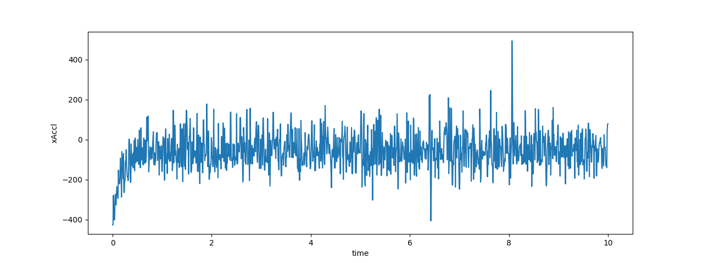
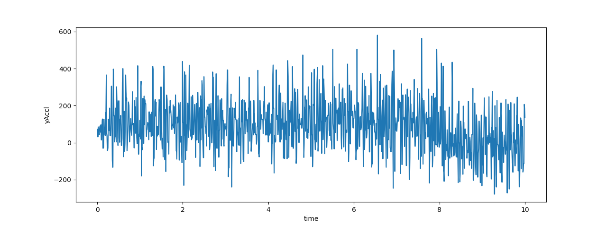

## Methodology and Results

Based on the results of our machine learning model, we have determined that the second activity dataset in our testing data is the trace of the car driving.
Because the car is driving on a flat plane, we can ignore the z-axis acceleration and use the x-axis and y-axis acceleration to determine the speed of the car.

